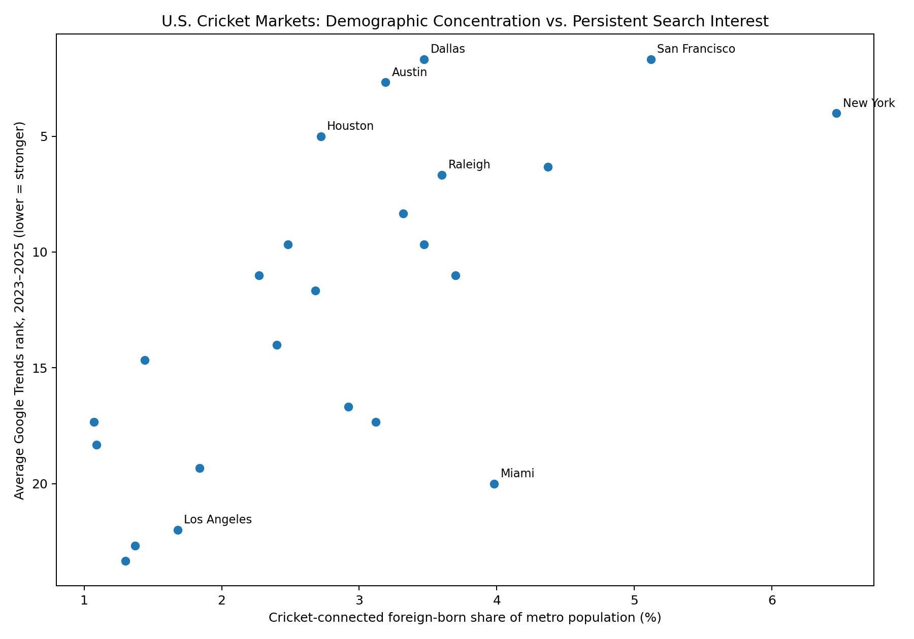
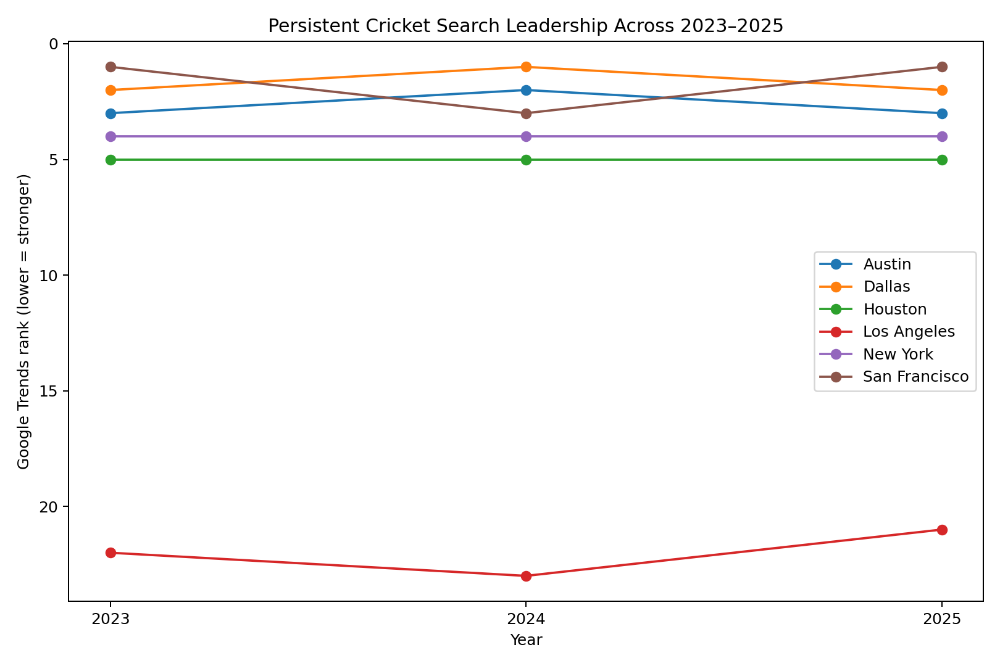
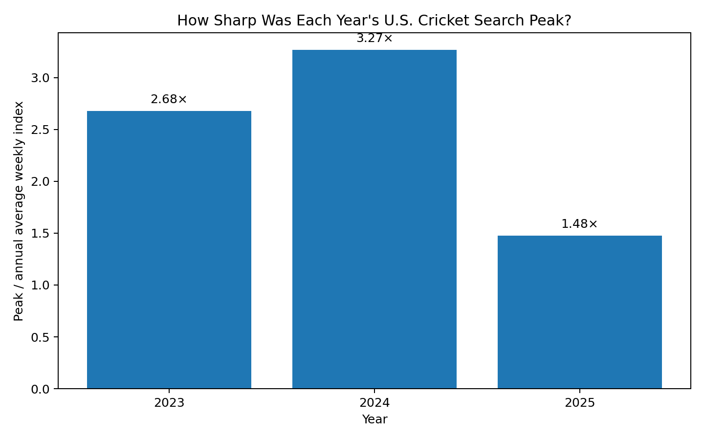

# U.S. Cricket Market Expansion Analysis

*A SQL-based analysis of 24 U.S. metro markets examining cricket search interest, cricket-connected diaspora populations, and professional cricket infrastructure ahead of LA28.*

## Why I built this project

Hello! My name is Anish More, and I’m a rising sophomore at Haverford College. As a varsity cricket player and lifelong cricket fan, the growth of cricket in the U.S. has always fascinated me. The 2024 T20 World Cup, co-hosted by the U.S., and the growth of Major League Cricket have made the sport more accessible to American audiences. As an American cricket fan with a passion for data, I wanted to use SQL to analyze domestic cricket growth patterns and explore what lessons cricket organizers can take into the 2028 Los Angeles Olympics.

## What I wanted to find out

When I began this project, my main aim was to find out whether the 2024 T20 World Cup and Major League Cricket contributed to the growth of cricket in the U.S. Specifically, I wanted to see whether the sport was gaining interest among people outside of cricket-connected diaspora communities, which I define later in this project.

What I found was that many of the strongest U.S. cricket markets also have significant cricket-connected diaspora communities, although markets like Austin and Houston show that demographics do not tell the whole story. Cricket still has a long way to go before becoming a mainstream American sport, but I hope my analysis can highlight potential markets where the sport could expand and offer lessons for LA28 organizers based on the shortcomings and successes of the 2024 World Cup and Major League Cricket.

## How I approached the project

For this project, I relied on three types of data:

1. **Demographic data:** I used U.S. Census demographic data for 24 metro areas as a baseline for each market. Specifically, I looked at foreign-born populations from countries and regions with strong ties to cricket, which I refer to as "cricket-connected" throughout this project. I also used the total population of each metro area so I could compare the size of these communities relative to the market as a whole.

2. **Google Trends data:** I used the Google Trends topic "Cricket - Sport" rather than a general search for "cricket," since the word can refer to things other than the sport. I collected weekly U.S. data from 2023–2025 to look for spikes in interest around major cricket events, including the 2024 T20 World Cup. I also collected geographic interest data for the same three years. Because Google Trends scores each search on a relative 0–100 scale, I couldn't directly compare scores from my separate yearly searches. Instead, I ranked the 24 markets within each year and compared their rankings across 2023–2025.

3. **Cricket infrastructure and event data:** I compiled information on existing U.S. cricket infrastructure and major events. This included Major League Cricket franchises and 2026 match locations, 2024 T20 World Cup host markets, official World Cup fan parks, and the planned LA28 cricket location. I included fan parks because some were held outside World Cup host cities, giving me another way to look at where organizers were trying to reach cricket audiences.

### What I mean by "cricket-connected"

I chose Census birthplace categories for 15 countries and regions because cricket has enjoyed relative popularity in each of them. While people from these diaspora communities are not necessarily cricket fans, these populations provide a useful demographic baseline for understanding the relationship between cricket interest in the U.S. and its diaspora communities.

Afghanistan; Australia and New Zealand Subregion; Bangladesh; Barbados; Guyana; India; Ireland; Jamaica; Nepal; Pakistan; South Africa; Sri Lanka; Trinidad and Tobago; United Kingdom (including Crown Dependencies); Zimbabwe.

## How I analyzed the data

To draw conclusions from my three types of data, I used SQL. I first created tables for the 24 MSAs, demographic data, and Google Trends rankings. Before adding the infrastructure and event data, I wanted to understand the relationship between demographics and search interest. I found that some markets with large cricket-connected populations ranked relatively low in search interest, while other markets consistently ranked highly despite having smaller cricket-connected populations.

I then added the infrastructure and event data. This helped me compare demonstrated interest with where professional cricket teams, matches, and major events were actually located. From there, I could begin identifying the needs of existing markets, potential future markets, and places where cricket interest remained consistently strong.

I also wanted to look beyond individual markets, so I analyzed nationwide weekly Google Trends data from 2023 through 2025. Major spikes appeared during international cricket events. The 2023 peak occurred during the ODI World Cup, while the 2024 peak occurred during the T20 World Cup co-hosted by the United States. The 2025 peaks also coincided with major international cricket moments, although there was no men's World Cup that year.

Because the yearly Google Trends series were normalized separately, I did not use their raw scores to claim that cricket searches increased or decreased from one year to another. Instead, I compared each year's peak with its own average weekly level. The 2024 peak reached 3.27 times its average weekly index, compared with 2.68 times in 2023 and 1.48 times in 2025.

## What I found

### 1. Austin and Houston show an opportunity to expand MLC's reach across Texas

Austin and Houston were two of the most interesting markets in my analysis. Austin had an average search-interest rank of #2.67 across 2023–2025 despite ranking only #10 in cricket-connected population share. Houston showed a similar pattern, ranking #5 in search interest but #13 in cricket-connected population share.

Neither city has its own MLC franchise or 2026 MLC matches in my dataset. Texas does already have an MLC franchise, though: the Texas Super Kings, based in the Dallas-Fort Worth market and playing at Grand Prairie Stadium.

Rather than treating Austin and Houston as completely disconnected from MLC, I think their results raise a different question: can the Texas Super Kings use their statewide identity to reach strong cricket markets beyond Dallas? Austin and Houston already show high levels of search interest, which could make them valuable markets for fan events, outreach, or eventually professional matches.

### 2. Dallas and San Francisco look like established cricket markets

Dallas and San Francisco were tied for the strongest average search-interest rank in my analysis at #1.67. Unlike Austin and Houston, both also have relatively large cricket-connected populations and significant MLC infrastructure.

These markets stood out because demographics, search interest, and professional cricket infrastructure all point in the same direction.

### 3. A large cricket-connected population doesn't always mean high cricket interest

Miami was probably the clearest example of this. It ranked #4 among the 24 markets in cricket-connected population share, but only #20 in average search interest.

On the other hand, markets like Austin and Houston ranked much higher in search interest than they did demographically. This suggests that demographics are important to U.S. cricket, but they do not completely explain why some markets show more interest than others.



### 4. The strongest markets stayed surprisingly consistent

One thing that surprised me was how consistent the leading markets were across all three years. San Francisco, Dallas, Austin, New York, and Houston remained near the top of the rankings across 2023, 2024, and 2025.

This is important because their strong performance wasn't limited to 2024, when the U.S. co-hosted the T20 World Cup.



### 5. Raleigh stands out without the same professional-cricket connection

Raleigh had an average search-interest rank of #6.67 and a cricket-connected population share of 3.60%, but none of the major infrastructure or event indicators included in my dataset.

What makes Raleigh especially interesting to me is that there isn't an obvious MLC connection like there is for Austin and Houston through the Texas Super Kings. Its strong and consistent search interest makes it worth examining as a potential market for future cricket outreach, fan events, or other smaller-scale investments before considering something as large as an MLC franchise.

### 6. Los Angeles presents a different challenge heading into LA28

Los Angeles had an average search-interest rank of only #22 and a cricket-connected population share of 1.68%. At the same time, Los Angeles has an MLC franchise, 2026 MLC matches, and will host cricket during the 2028 Olympics.

To me, this makes Los Angeles one of the most interesting markets to watch. Unlike Dallas or San Francisco, the challenge may not simply be serving an existing cricket audience. LA28 creates an opportunity to see whether professional cricket and a major international event can help build interest in a market where my existing indicators are relatively weak.

### The World Cup created a major spike in national attention

The peak during the 2024 T20 World Cup reached 3.27 times that year's average weekly Google Trends index. For comparison, the 2023 ODI World Cup year's peak was 2.68 times its annual average, while the 2025 peak was 1.48 times its annual average.

This does not prove that the 2024 World Cup created sustained cricket growth in the U.S. What it does show is that the U.S.-hosted World Cup coincided with an unusually concentrated spike in American search interest.



## My takeaway

My biggest takeaway is that U.S. cricket organizers face two different challenges. Cricket's existing diaspora communities are still an important foundation for the sport, and organizers should continue building relationships with those communities. At the same time, true nationwide growth will eventually require cricket to reach Americans outside of its traditional audience.

Markets like Austin and Houston especially interest me because their search-interest rankings outperform their demographic rankings. Understanding why cricket performs well in markets like these could provide useful lessons for Major League Cricket and for organizers preparing for LA28.

## Limitations

Even though my data can provide valuable insights, there are several things it cannot prove.

1. **Google Trends does not show absolute search volume.** Google Trends reports relative interest rather than the actual number of searches. Because I collected each year separately, I cannot use the raw scores to prove that cricket became more or less popular nationally between 2023 and 2025.
2. **Google Trends cannot tell us who searched for cricket.** People could have searched out of curiosity, discovered the sport through a major event, or already been existing fans. Trends cannot specifically tell us how many new cricket fans were created.
3. **My definition of a "cricket-connected" population is only a proxy.** Birthplace alone cannot tell us someone's interest in cricket. Cricket also competes with other sports for younger audiences in some of these places, particularly in the UK and Caribbean. My measure also leaves out U.S.-born cricket fans and later generations of diaspora communities who may still have strong connections to the sport. I still believe it provides a useful demographic baseline given the limited amount of U.S. cricket-specific demographic data available.
4. **Census MSAs and Google Trends DMAs do not cover the exact same geographic areas.** Their different boundaries could create some over- or underestimation when comparing the two datasets. I matched each DMA with the closest corresponding MSA; many shared the same primary city names, but the areas still do not perfectly overlap.
5. **My analysis only covers 24 U.S. metro markets.** It leaves out parts of the country that could also be contributing to cricket's growth, including smaller cities and towns and some suburban communities with cricket-connected populations.

## Reproducing the analysis

All cleaned CSV files used in the analysis are included in the `data/` folder. The SQL files are numbered in the order they should be run.

### Requirements
- PostgreSQL
- `psql` or a PostgreSQL client such as DBeaver

### Run order
1. `sql/01_create_tables.sql`
2. `sql/02_import_data.sql`
3. `sql/03_analysis.sql`
4. `sql/04_final_market_view.sql`

If you use `psql`, run these commands from the repository root. If you use DBeaver, create the tables first and import the matching CSVs from the `data/` folder.

After creating the final view:

```sql
SELECT *
FROM market_opportunity_summary
ORDER BY avg_interest_rank;
```

## Repository structure

```text
us_cricket_market_analysis/
├── README.md
├── .gitignore
├── data/
│   ├── markets.csv
│   ├── foreign_born_population.csv
│   ├── cricket_interest_2023_2025.csv
│   ├── cricket_infrastructure.csv
│   ├── national_cricket_interest_2023_2025.csv
│   └── final_master_market_analysis.csv
├── sql/
│   ├── 01_create_tables.sql
│   ├── 02_import_data.sql
│   ├── 03_analysis.sql
│   └── 04_final_market_view.sql
├── charts/
│   ├── demographics_vs_interest.png
│   ├── no_2026_mlc_matches.png
│   ├── national_peak_to_average.png
│   └── market_rank_persistence.png
└── methodology/
    └── data_sources.md
```

## Data sources

The project uses data from the U.S. Census Bureau's 2024 American Community Survey 5-Year Estimates, Google Trends, Major League Cricket, the International Cricket Council, and LA28. Exact tables, links, definitions, and sourcing notes are documented in [`methodology/data_sources.md`](methodology/data_sources.md).

## Tools used

- PostgreSQL / SQL
- DBeaver
- U.S. Census ACS
- Google Trends
